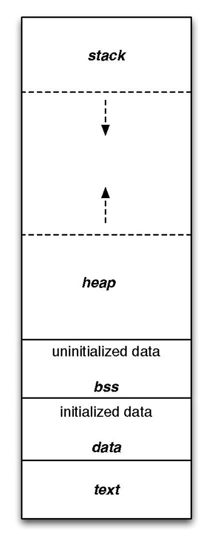

# 存放区域

代码区、常量区、静态全局区、堆区、栈区

.data .rodata .text .bss




上图中，从上到下，地址从高到低。

|区域|区域|存放内容|读写|
|:---:|:--:|:--:|:--:|
|stack|栈区|临时变量(无论是否初始化)、函数入口|向下生长|
|heap|堆区|malloc、new|向上成长|
|.bss|静态全局区|未初始化的全局变量，默认赋值为0|可读可写|
|.data|静态全局区|已经初始化的全局变量|可读可写|
|.text|代码区|代码、预设的变量值、全局常量|只读|


## 例子

### C

``` c
int global_1;
int global_2;

char* global_init_1 = "Hello";
char* global_init_2 = "Hello";

const int const_1 = 6;

int main()
{
    static int static_1;
    static int static_2;

    int local_1;
    int local_init_1 = 0;
    int local_2;
    int local_init_2 = 0;

    int* heap_1 = (int*)malloc(32);
    int* heap_2 = (int*)malloc(32);

    const int const_2 = 9;
}
----------Output--------
&heap_2       :0x691FB140  // 指向malloc的指针储存在栈区
&heap_1       :0x691FB138
const_2       :0x691FB134  // 局部常量储存在栈区
local_init_2  :0x691FB130
local_2       :0x691FB12C
local_init_1  :0x691FB128
local_1       :0x691FB124
--------^stack^---------
heap_2        :0x019FC040  // malloc申请的空间储存在堆区
heap_1        :0x019FC010
---------^heap^---------
global_2      :0x00601070
global_1      :0x0060106C
static_2      :0x00601064
static_1      :0x00601068
----------^bss^---------
&global_init_2:0x00601058
&global_init_1:0x00601050
---------^data^---------
const_1       :0x004008CC  // 全局常量储存在text区
 global_init_1:0x004008C4
 global_init_2:0x004008C4  // dahua考题，两指针指向同一地址
---------^text^---------
```
.text中预设的变量值会在程序启动阶段拷贝到.data区域为全局变量赋值。

### C++

```c++
class D
{
public:
    void printA()
    {
        cout<<"printA"<<endl;
    }
    virtual void printB()
    {
        cout<<"printB"<<endl;
    }
};
int main(void)
{
    D *d=NULL;
    d->printA();
    d->printB();

--- Output ---


```

## 几个疑问

### 程序运行时系统会分配给他多大的空间？

因为栈是向下生长的，堆是向上生长的，那么分配给程序的大小就已知了。这个大小是怎么确定的？在程序运行的时候会变化吗？


## Reference

1. [linux 堆、栈、全局变量存放](https://blog.csdn.net/kkxgx/article/details/7520902)

2. [什么是代码区、常量区、静态区（全局区）、堆区、栈区？](https://blog.csdn.net/u014470361/article/details/79297601)

3. [C++成员函数在内存中的存储方式](https://blog.csdn.net/fuzhongmin05/article/details/59112081)

4. [Wikipedia - Data segment](https://en.wikipedia.org/wiki/Data_segment)

5. [程序各个段text,data,bss,stack,heap](https://www.cnblogs.com/jamesnt/p/3747216.html)

6. [浅谈程序中的text段、data段和bss段](https://zhuanlan.zhihu.com/p/28659560)