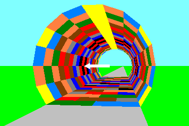

# 鱼眼相机

## 介绍

通读[《鱼眼镜头是怎么「鱼眼」的？》](https://zhuanlan.zhihu.com/p/29273352)这篇文章，讲的非常好。

## 投影方式

维基百科[Fisheye lens](https://en.wikipedia.org/wiki/Fisheye_lens)上有对几种投影方式的介绍，文章[鱼眼镜头是怎么「鱼眼」的？](https://zhuanlan.zhihu.com/p/29273352)里也有介绍，并对应用场合作出了举例。

对于如下的场景，对于不同的投影方式会有不同的投影结果。  

下式中，$\theta$为入射角，表示入射光线与光轴的夹角。$f$为焦距。$r$为距离，表示成像点距离图像中心的距离。
### 普通镜头投影方式
* 透视投影 Rectilinear  
  类似于针孔模型。从公式可以看出$r$和$f$就是直角三角形的两条直角边。  
  映射函数：$r=ftan(\theta)$
    
  普通的镜头都是这个。视野范围比较窄。虽说$\theta$可以达到接近90度，但是越靠近90度，$r$会急剧增大，所以实际中最多也就60多度吧，也就是水平视角130多度。
### 鱼眼镜头投影方式
* 体视投影 Stereographic, panoramic  
  保角变换，任何直线相交的角度，在变换之后是保持不变。  
  映射函数：$r=2ftan(\frac{\theta}{2})$  
  图中直线之间的夹角仍是90度，圆仍然是圆。  
    
  由于其对位于图像边缘的物体压缩较少，所以常用于摄像。

* 等距投影 Equidistant  
  等距的意思是，随着入射角的逐渐变大，投影点到图像中心的距离线性的增大。  
  映射函数：$r=f\theta$  
  图中中间一列每个方块的高度是一样的。  
    
  由于像素距离和角度的线性关系，通过像素距离很方便反推出角度，所以常用于角度测量，如星图，武器瞄准系统。还有日常用的图像拼接。

* 等积投影 Equisolid angle  
  保持变换前后，物体所占的立体角大小不变。  
  映射函数：$r=2fsin(\frac{\theta}{2})$  
  图中每一列中所有方格的面积相同。  
    
  由于这种特性，在半球形空间中，半球面上两个面积相同的图案，成像后在成像平面上的两个图案的面积仍然相同。所以可以用于测量天空中云量覆盖情况，对着天空拍摄，通过图像中云与天空的像素比即可计算出云量覆盖情况。

* 正交投影 Orthographic  
  映射函数：$r=sin(\theta)$

    
  最大视场角不能超过180度，图像边缘压缩严重，但图像中心压缩较小。实际很少用。 

常用的是等距投影和等积投影。

### Q&A
* 实际设计中是如何实现这几种投影方式的呢？
  > 不同的镜片组合会产生不同的畸变，在设计的时候，就把特定投影方式作为目标，不断改变镜片组合，去逼近这个目标函数  
  --摘抄自[鱼眼镜头是怎么「鱼眼」的？](https://zhuanlan.zhihu.com/p/29273352)

* 有没有办法判断镜头属于哪种投影方式？
  > 根据厂商提供的 水平 / 垂直 / 对角 三个方向的视角范围，带入上面公式，看看哪个最接近，一般是可以粗略判断的  
  --摘抄自[鱼眼镜头是怎么「鱼眼」的？](https://zhuanlan.zhihu.com/p/29273352)

  这个怎么计算呀？没明白。如$D:200^{\degree},H:190^{\degree},V:120^{\degree}$这样一个参数与的镜头应该是哪种投影方式。

### 扩展

镜头的投影方式有如此之多，所以就有关于标定的论文提出，使用多项式拟合的方式来对这些投影方式进行建模。

Kannala J , Brandt S S . A Generic Camera Model and Calibration Method for Conventional, Wide-Angle, and Fish-Eye Lenses[J]. IEEE Transactions on Pattern Analysis and Machine Intelligence, 2006, 28(8):1335-1340.

## 标定工具

有很多工具说是可以适用于fisheye，但是用的还是针孔模型，只是畸变参数多用了一阶泰勒展开，如OpenCV。

### Q&A
如何判断到底是不是真正的fisheye？

从标定结果去判断，看标定的相机内参，如果还存在$f_x$和$f_y$，那么还是针孔模型。

### OpenCV流派

OpenCV目前还没有能用的！！

#### [不可用][OpenCV fisheye](https://docs.opencv.org/3.3.1/db/d58/group__calib3d__fisheye.html)

这个算法用的是什么模型？  
[其作者说了](https://github.com/opencv/opencv/pull/2889)是使用的Matlab中[Camera Calibration Toolbox](http://www.vision.caltech.edu/bouguetj/calib_doc/index.html#links)的方法。OpenCV中的fisheye指的是FOV比较大但是在180度以内的，对于超过180度的（他们称super-fisheye）不适用。

有人对OpenCV中fisheye的可用性[提出了质疑](https://stackoverflow.com/questions/31089265/what-are-the-main-references-to-the-fish-eye-camera-model-in-opencv3-0-0dev)，质疑的非常对，我看了一下OpenCV的文档，fisheye仍然是针孔模型，
$$\theta=atan(r)$$
仅仅是镜像畸变多用了一阶泰勒展开
$$\theta_{d}=\theta(1+k_1 \theta^2+k_2 \theta^4+ k_3 \theta^6+k_4 \theta^8)$$

此人也提到了OpenCV4会修复这个问题，[目前的更新](https://github.com/opencv/opencv/wiki/ChangeLog)没看到，关注后续吧版本吧。

因此，目前基于OpenCV的fisheye的工具都不可用！！！如，ROS中的camera_calibration工具。

#### [OpenCV Contrib omnidir](https://github.com/opencv/opencv_contrib/blob/master/modules/ccalib/tutorials/omnidir_tutorial.markdown)

[Multi-camera Calibration](https://github.com/opencv/opencv_contrib/blob/master/modules/ccalib/tutorials/multi_camera_tutorial.markdown)可以同时标定多个相机的内参以及相互之间的位置，而且支持真正的fisheye相机，其参考的论文为

Li B , Heng L , Koser K , et al. A multiple-camera system calibration toolbox using a feature descriptor-based calibration pattern[C]// IEEE/RSJ International Conference on Intelligent Robots & Systems. IEEE, 2014.

### Matlab流派

推荐Matlab自带的`Camera Calibrator`！！！  

关于Matlab中fisheye原理的说明：[Fisheye Calibration Basics](https://www.mathworks.com/help/vision/ug/fisheye-calibration-basics.html#mw_8aca38cc-44de-4a26-a5bc-10fb312ae3c5)  

注意：只有新版本的Matlab才有标定fisheye相机的功能，R2017b中没有，R2019a中加入了fisheye的标定！

很多论文的作者也有Matlab的示例代码，原理没问题，就是有些代码比较老，太难用。

#### [不好用][OCamCalib Toolbox](https://sites.google.com/site/scarabotix/ocamcalib-toolbox) 
代码使用起来太不友好，还是直接使用Matlab2019，里面用的就是该作者提出的算法。  
Omnidirectional Camera Calibration Toolbox for Matlab  
作者`Scaramuzza, D.`，[此处](https://sites.google.com/site/scarabotix/ocamcalib-toolbox/ocamcalib-toolbox-download-page)有其对应发表的论文以及源代码。  
作者自称This toolbox is currently used by NASA, PHILIPS, BOSCH, DAIMLER，貌似很强大。

