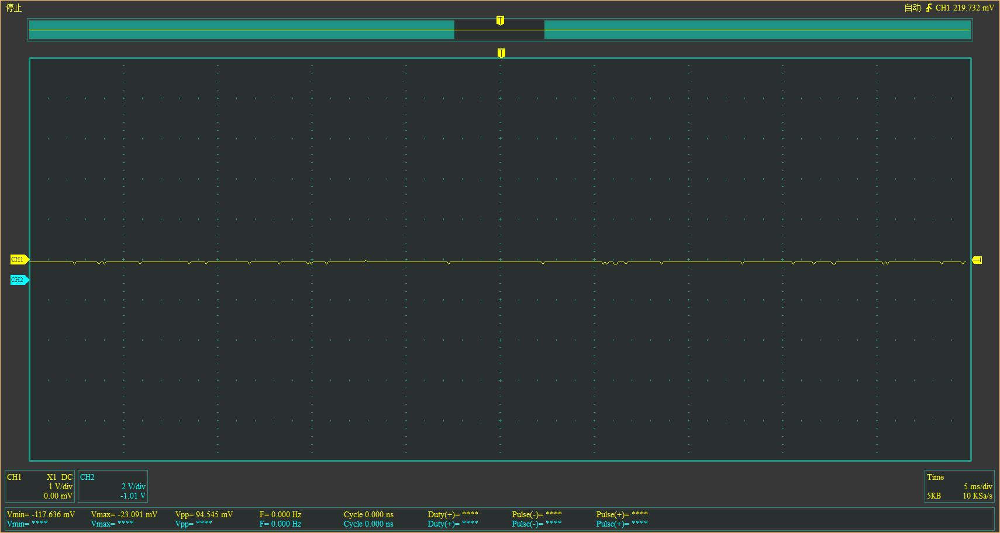
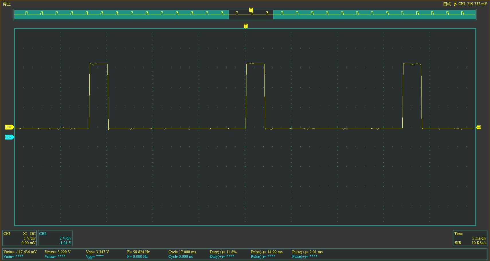

# 遥控器接收机信号解析

## 油门信号

* 接收器上电，但未连接到遥控器

* 接收器与遥控器连接成功，零油门

正脉冲会在1.50-1.59ms之间波动，1.50ms附近的偏多。周期17.0ms几乎保持稳定。  

* 加速  
正脉冲的占空比会随着油门的增大而变大。  

全油门时的波形如上，2.00-2.10ms之间波动。

* 刹车  
正脉冲的占空比会随着刹车力度的增大而变小。  

全刹车时的波形如上，0.9ms-1.0ms之间波动，1.0ms附近的偏多

* 丢失信号（通过关闭遥控器模拟）  
回到0油门时候的波形。即1.5ms左右的正脉冲。无论丢失信号时油门的状态如何，都会回到0油门时候的波形，以保证安全。

* 找到信号重新连接  
保持0油门时的波形。

**总结：控制信号为周期为17ms的脉冲，中位信号为高电平1.50ms，极限信号为1.0ms和2.0ms。**
## 转向信号

所有的信号都和油门信号保持一致。
* 右转  
同加速信号。

* 左转  
同刹车信号。

## 第三四辅助通道信号

待补充。。。
