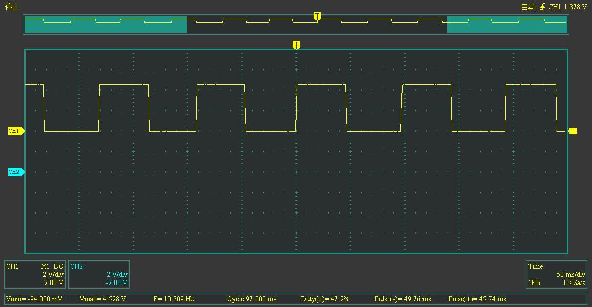
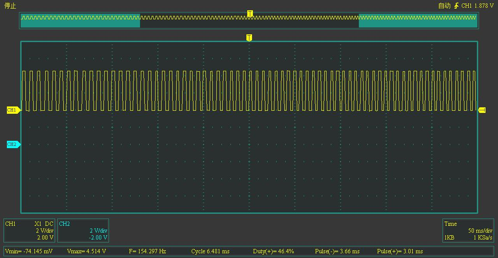

# 电机信号

> 与普通的有刷电机和无刷电机不同，有感无刷电机内置传感器，能够将电机转速信息传给电调，从而使电调能够更好的控制电机。得益于此，我们可以中途监听这些信号，获得电机转速，用于上层算法。节省了编码器的安装空间和成本。

|pin脚号|pin脚定义|功能|
|:---:|:---:|:---:|
|1|GND|电调为传感器供电|
|2|D1|转速相关信号，|
|3|D2||
|4|D3||
|5|Temperature|网上有的说是温度传感器|
|6|VCC|电调为传感器供电|

Pin16为供电线，其中Pin1为电调上靠近风扇供电口的一端。  
Pin234为霍尔传感器输出信号？为50%占空比的PWM波，转速越快，频率越高。  
Pin5信号未知，为2.3V左右电压，与转速无关。    

下图为速度很慢时Pin2的输出波形。频率为10.3Hz。  
  
下图为转速稍快时Pin2的输出波形。频率为154.3Hz。  
  
