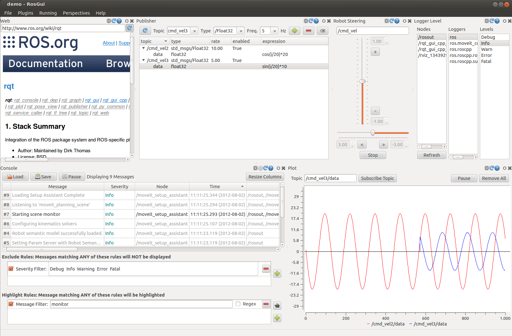

# 设计自己的rqt插件

## 为什么要基于rqt的框架开发plugin

可以和其他rqt的plugin共同组成控制面板，根据不同的场景创建不同的控制面板。

比如，下图中拖动滑块会导致曲线发生怎样的变化，使用rqt的框架就很酷。

[When should I use rviz, rqt or gazebo?](https://answers.ros.org/question/317316/when-should-i-use-rviz-rqt-or-gazebo/)

## 如何开发？

[rqt/Tutorials](http://wiki.ros.org/rqt/Tutorials)

## 相关链接

* [开发rviz中的插件](http://www.guyuehome.com/945)
  有一个例子，除此之外，作者这个是ROS系列教程。
