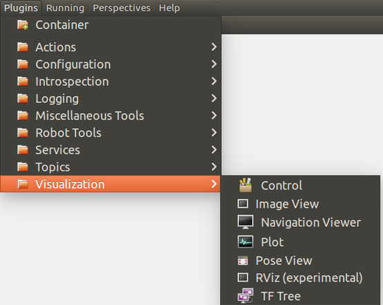

# 设计自己的rqt插件

## 总览

### 为什么要基于rqt的框架开发plugin

可以和其他rqt的plugin共同组成控制面板，根据不同的场景创建不同的控制面板。

比如，下图中拖动滑块会导致曲线发生怎样的变化，使用rqt的框架就很酷。


[When should I use rviz, rqt or gazebo?](https://answers.ros.org/question/317316/when-should-i-use-rviz-rqt-or-gazebo/)

ROS官方也提出了他们的优点：

rqt_gui upon using multiple rqt plugins has following advantages:  
* Multiple rqt plugins can be docked into a single window  
  * Layout can be flexibly customized
  * Each plugin pane can be stripped out from rqt_gui and floated around
* The perspective (plugins opened and their positions, sizes) from previous runtime can be restored
  
[rqt_gui](http://wiki.ros.org/rqt_gui)

### 如何开发？


[rqt/Tutorials](http://wiki.ros.org/rqt/Tutorials)

* 建议使用python开发插件（除非对性能有要求，或所需要的库只有C++的，或C++远比python熟练）

## rqt plugin

### 目录结构

先总体看一下plugin的目录结构，与package的目录结构有所不同。也可参考一下rqt中现有的[plugin代码](https://github.com/ros-visualization/rqt_common_plugins/tree/efc7c7e30533c598869943fb400a5744c7d30881)。

<rqt_plugin_demo>  
&emsp;&emsp;├── `CMakeLists.txt` #5  
&emsp;&emsp;├── `package.xml` #2  
&emsp;&emsp;├── `plugin.xml` #3  
&emsp;&emsp;├── `setup.py` #4  
&emsp;&emsp;├── resource  
&emsp;&emsp;│&emsp;&emsp;└── `*.ui`  
&emsp;&emsp;├── scripts  
&emsp;&emsp;│&emsp;&emsp;└── `<rqt_plugin_demo>` #8  
&emsp;&emsp;├── src  
&emsp;&emsp;│&emsp;&emsp;└── <rqt_plugin_demo>  
&emsp;&emsp;│&emsp;&emsp;&emsp;&emsp;&emsp;├── `__init__.py` #6  
&emsp;&emsp;│&emsp;&emsp;&emsp;&emsp;&emsp;└── `plugin_demo.py` #7  
&emsp;&emsp;└── test 

### 操作流程

下文中
`<rqt_plugin_demo>`修改为该plugin的package的名称，修改


1. 创建新的pkg  
   这个命令会创建package所需要的最小目录结构。
   ``` bash
   # change directory to src folder in workspace
   $ cd src/  
   # create a new package named rqt_plugin_name
   $ catkin create pkg <rqt_plugin_demo> --catkin-deps rospy rqt_gui rqt_gui_py
   ```
2. 修改`package.xml`文件
   * 移除不需要的`<build_depend>`部分，
   * 在`<export>`中添加声明，否则无法找到该plugin  

   修改后的文件如下：
    ``` xml
    <?xml version="1.0"?>
    <package format="2">
      <name><rqt_plugin_demo></name>
      <version>0.0.0</version>
      <description>The <rqt_plugin_demo> package</description>
      <maintainer email="xxx@todo.todo">sunjian4</maintainer>
      <license>TODO</license>

      <buildtool_depend>catkin</buildtool_depend>
      <build_export_depend>rospy</build_export_depend>
      <build_export_depend>rqt_gui</build_export_depend>
      <build_export_depend>rqt_gui_py</build_export_depend>
      <exec_depend>rospy</exec_depend>
      <exec_depend>rqt_gui</exec_depend>
      <exec_depend>rqt_gui_py</exec_depend>

      <export>
        <rqt_gui plugin="${prefix}/plugin.xml"/>
      </export>
    </package>
   ```

4. 在`package.xml`同级目录下创建`setup.py`文件  
   添加如下内容，修改
    ``` python
    from distutils.core import setup
    from catkin_pkg.python_setup import generate_distutils_setup

    d = generate_distutils_setup(
        packages=['<rqt_plugin_demo>'],
        package_dir={'': 'src'},
        scripts=['scripts/<rqt_plugin_demo>']
    )

    setup(**d)
    ```
5. 修改`CMakeLists.txt`文件
   * 添加`catkin_python_setup()`
   * 添加xxx
   * 添加xxx
    ``` cmake
    cmake_minimum_required(VERSION 2.8.3)
    project(<rqt_plugin_demo>)
    # Load catkin and all dependencies required for this package
    find_package(catkin REQUIRED)
    catkin_package()
    catkin_python_setup()

    install(FILES plugin.xml
    DESTINATION ${CATKIN_PACKAGE_SHARE_DESTINATION}
    )

    install(DIRECTORY resource
    DESTINATION ${CATKIN_PACKAGE_SHARE_DESTINATION}
    )

    install(PROGRAMS scripts/<rqt_plugin_demo>
    DESTINATION ${CATKIN_PACKAGE_BIN_DESTINATION}
    )
    ```
6. 在`src/`文件夹下创建`__init__.py`空文件  
   
   该文件的作用就是相当于把自身整个文件夹当作一个包来管理，每当有外部import的时候，就会自动执行里面的函数。
7. 在`src/`文件夹下创建`<plugin_demo>.py`文件，在该文件中实现该插件的功能。
    ``` python
    import os
    import rospy
    import rospkg

    from qt_gui.plugin import Plugin
    from python_qt_binding import loadUi
    from python_qt_binding.QtWidgets import QWidget

    class PluginDemo(Plugin):
        xxx
    ```
8. 在`scripts/`文件夹下创建`<rqt_plugin_demo>`文件
    ``` python
    import sys

    from rqt_gui.main import Main
    from <rqt_plugin_demo>.<plugin_demo> import <PluginDemo>

    plugin = '<rqt_plugin_demo>'
    main = Main(filename=plugin)
    sys.exit(main.main(standalone=plugin))
    ```
3. 在`package.xml`同级目录下创建`plugin.xml`文件
   
   复制下面内容到该文件，修改其中的几项：

   * 修改`group_label`为该插件所属的组，可选项有：`Actions`,`Configuration`,`Introspection`,`Logging`,`Miscellaneous Tools`,`Services`,`Topics`,`Visualization`。参见现有的[Plugins](http://wiki.ros.org/rqt/Plugins)看看你的插件应该属于哪一组。  
    这个选项的效果就是你的插件会出现在对应的组中。  
     

   * 修改`plugin_label`为该插件的名称，其会显示到选项卡中，如`Plot`  
   * 修改`plugin_icon`将决定该插件前显示的图标，可选项有：`applications-other`, , ,. 参见[Icon Naming Specification](https://specifications.freedesktop.org/icon-naming-spec/icon-naming-spec-latest.html)，
    ``` xml
    <library path="src">
      <class name="MyPlugin" type="<rqt_plugin_demo>.bag.Bag" base_class_type="rqt_gui_py::Plugin">
        <description>
          description about this plugin.
        </description>
        <qtgui>
          <group>
            <label>group_label</label>
            <icon type="theme">folder</icon>
            <statustip>Plugins related to logging.</statustip>
          </group>
          <label>plugin_label</label>
          <icon type="theme">plugin_icon</icon>
          <statustip>xxx</statustip>
        </qtgui>
      </class>
    </library>
    ```
9. 打开Qt Creator，从File -> New File or Project -> Qt -> Qt Designer Form创建空的`.ui`文件，并保存到`resource/`文件夹中。
## 参考

1. 

## 相关链接

* [开发rviz中的插件](http://www.guyuehome.com/945)
  有一个例子，除此之外，作者这个是ROS系列教程。
